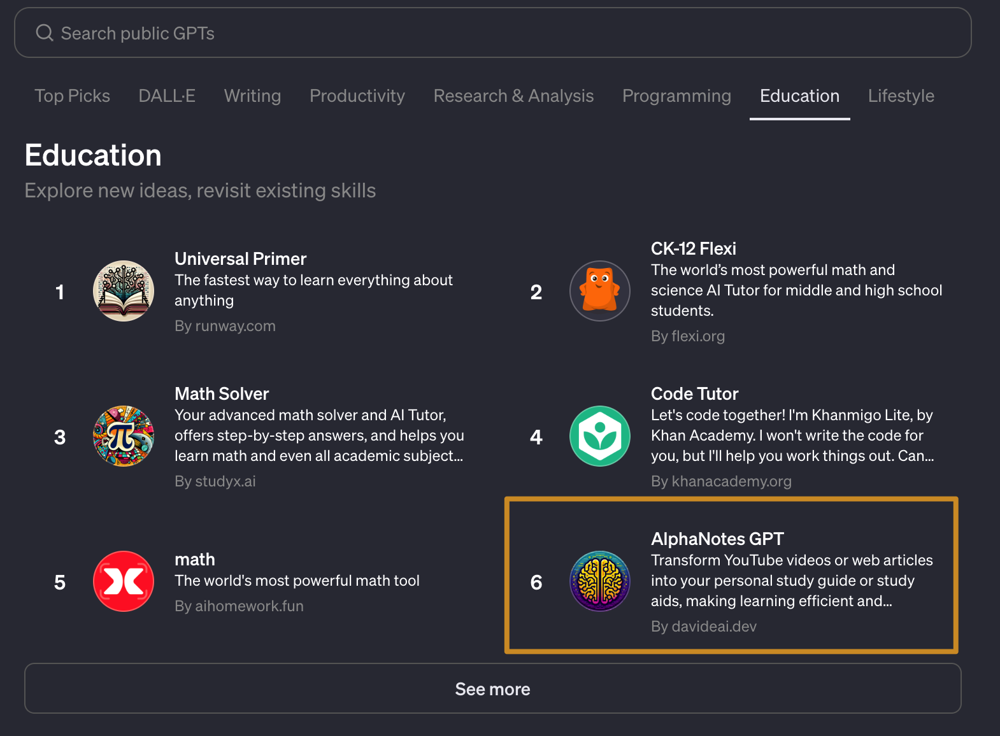
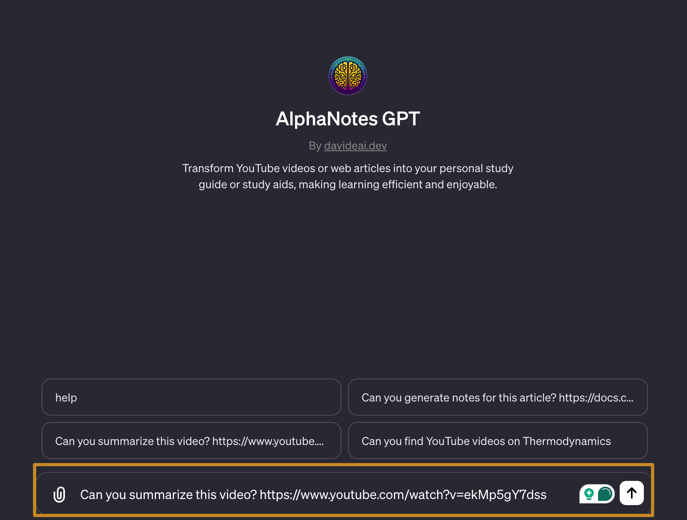

---
meta:
  title: "Getting started with AlphaNotes"
description: Start with AlphaNotes on ChatGPT and Streamline learning with AI. Requires ChatGPT Plus. Find us in the GPT Store for smarter education.
label: Getting Started
icon: rocket
order: 9
---

# Welcome to AlphaNotes

Embark on a journey of streamlined learning with AlphaNotes, where AI meets your educational needs.

## Prerequisites

Before you dive in, ensure you're equipped with:

**1. ChatGPT Plus Subscription**  
A [ChatGPT Plus](https://openai.com/blog/chatgpt-plus) subscription is required as you'll need access to the GPT store.

## Discovering AlphaNotes

Where can I find AlphaNotes?

**1. Access the GPT Store**  
Begin by visiting the [GPT Store](https://chat.openai.com/gpts).

**2. Locate AlphaNotes**  
Use the search function to find **AlphaNotes** directly, or browse the **Education** category, where we're often featured among the top 12!

> 💡 Tip: Look for the AlphaNotes icon—it's your gateway to smarter learning!

You can also get to **AlphaNotes** directly from here 👇

[!button corners="pill" text="AlphaNotes" size="2xl" target="blank"](https://chat.openai.com/g/g-ZdfrSRAyo-alphanotes-gpt)

## Initiating AlphaNotes

**Engage with AlphaNotes**

Interact with **AlphaNotes** for quick summaries or in-depth notes. Use our sample prompts to get familiar with the command patterns.

> 💡 Remember: You can summon **AlphaNotes** in any ChatGPT window by typing @alphanotes.

Upon your first command, you'll be guided to log in. As a new user, you'll automatically start on our complimentary plan with various login methods:

- **Passwordless Login via Email**: Opt for this to jump straight into AlphaNotes without a password. It's the quickest way to discover what AlphaNotes can do for you.

- **Google Authentication**: Leverage any Google account for a hassle-free login experience.

- **GitHub OAuth Authentication**: For those seeking a secure and enriched experience, GitHub authentication is your key to unlocking all the advanced features AlphaNotes offers.

Ready to transform your learning experience? Let's get started with AlphaNotes today!
