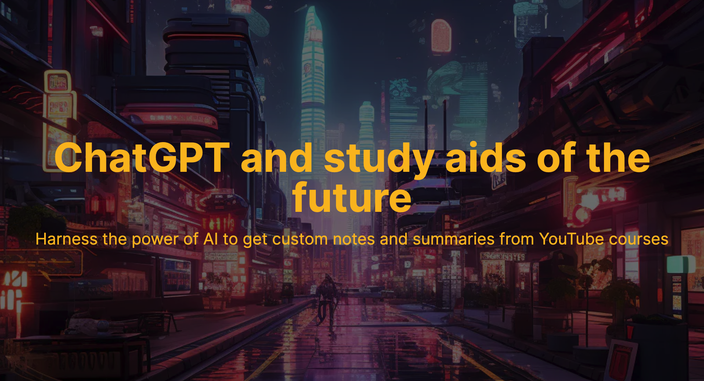

# AlphaNotes

## Introducing AlphaNotes GPT

AlphaNotes GPT is a customized GPT variant specifically designed to enhance learning experiences. It specializes in distilling complex digital content into easy-to-understand summaries and study aids. Whether it's a YouTube video, an article, or a lecture, AlphaNotes GPT transforms this content into concise, manageable formats ideal for study and review.

With AlphaNotes GPT, learners and educators can easily convert extensive information into concise notes and summaries and even create PDFs for easier access and distribution.

Experience the power of AI in education with AlphaNotes GPT. Dive into a world where learning is simplified and knowledge is just a click away.

## The future of learning with AlphaNotes and ChatGPT

In an era where information is the cornerstone of success, AlphaNotes stands out by seamlessly integrating the capabilities of ChatGPT to deliver tailor-made notes and comprehensive summaries. Get into the depths of YouTube courses and articles and emerge with crystal-clear understanding, all facilitated by the unparalleled intelligence of ChatGPT.

With AlphaNotes, you unlock:

- **AI-Driven Summarization:** Transform lengthy videos and articles into structured summaries, perfect for quick reviews or deep dives.
- **Custom Study Notes:** Let ChatGPT distill essential information into accessible notes, highlighting crucial points and simplifying complex concepts.
- **Learning Efficiency:** Maximize your time and effort with AI that understands the essence of your educational material.
- **Interactive Learning:** Engage with the content through AI-generated quizzes and assessments that reinforce your grasp of the subject.
- **Direct Integration:** Experience the seamless fusion of AlphaNotes with ChatGPT's cutting-edge technology, catering to a generation that values efficiency and precision in learning.

Perfect for students, professionals, and lifelong learners, AlphaNotes powered by ChatGPT is your strategic advantage in navigating the vast sea of knowledge. Step into a world where learning is optimized, and every summary and note is a step towards your personal and professional zenith.

Optimize your learning with AlphaNotes - where AI meets your educational aspirations.

[!button corners="pill" text="Try now on ChatGPT" size="2xl" target="blank"](https://chat.openai.com/g/g-ZdfrSRAyo-alphanotes-gpt)

## What is a GPT?

GPT, or Generative Pretrained Transformer, is an advanced AI model designed by OpenAI. It excels in understanding and generating human-like text. By tailoring their instructions, knowledge, and capabilities, GPTs can be customized for specific tasks, ranging from creative writing to technical support.

The essence of GPTs lies in their ability to process vast amounts of information and generate contextually relevant responses. This makes them highly adaptable for various applications, especially in educational and content creation domains.
