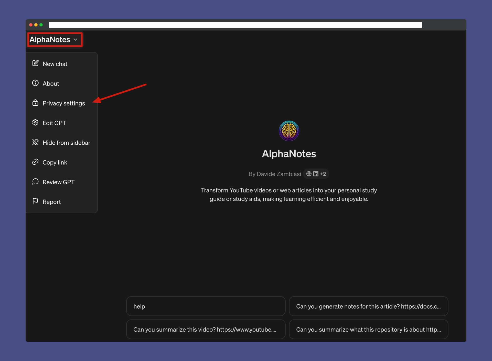

---
meta:
  title: "AlphaNotes account managing page"
description: Manage your AlphaNotes subscription easily. Update, cancel, or modify your plan hassle-free on our account management page.
label: Manage account
icon: key
order: 3
---

# Managing your AlphaNotes account

Take control of your AlphaNotes experience by managing your account with ease. Follow the straightforward steps below to make any necessary adjustments to your subscription.

## Accessing your account

**1. Navigate to Your Account Page**  
Visit the AlphaNotes account page and directly access the account management portal at [Manage Your Subscription](https://a2c4cd8d45397b49d717bfbda6084041.auth.portal-pluginlab.ai/pricing).

## Subscription management

**2. Manage Your Subscription**  
Once you're logged in, locate the 'Manage subscription' option in the top right corner of the page. This is your hub for subscription details and adjustments.

**3. Cancel Your Plan**  
If you need to cancel your plan, click 'Cancel plan.' We've made it hassle-free – no questions asked, no complicated procedures.

> 💡 Remember: We value your experience and feedback. If you're considering cancellation, we'd love to hear why and how we might improve. Your insights are vital for us to grow and serve you better.

### Additional account options

Besides managing your subscription, your account page allows you to explore different plan options.

## Logout from Your AlphaNotes Session

You can also manually log out from the GPT in case you need to change accounts, or you wish to:

- Click on the AlphaNotes name in the top left corner.
- Click on "Privacy settings."

- Select "Connected accounts" and click "Logout."

## Need help?

If you encounter any issues or have questions about managing your account, our support team is here to assist you. Reach out through our [Contact Us](https://www.alphanotes.one/contact) page, and we'll ensure your experience is smooth and satisfying.

Embrace the full potential of AlphaNotes and tailor your learning journey to suit your individual needs.
