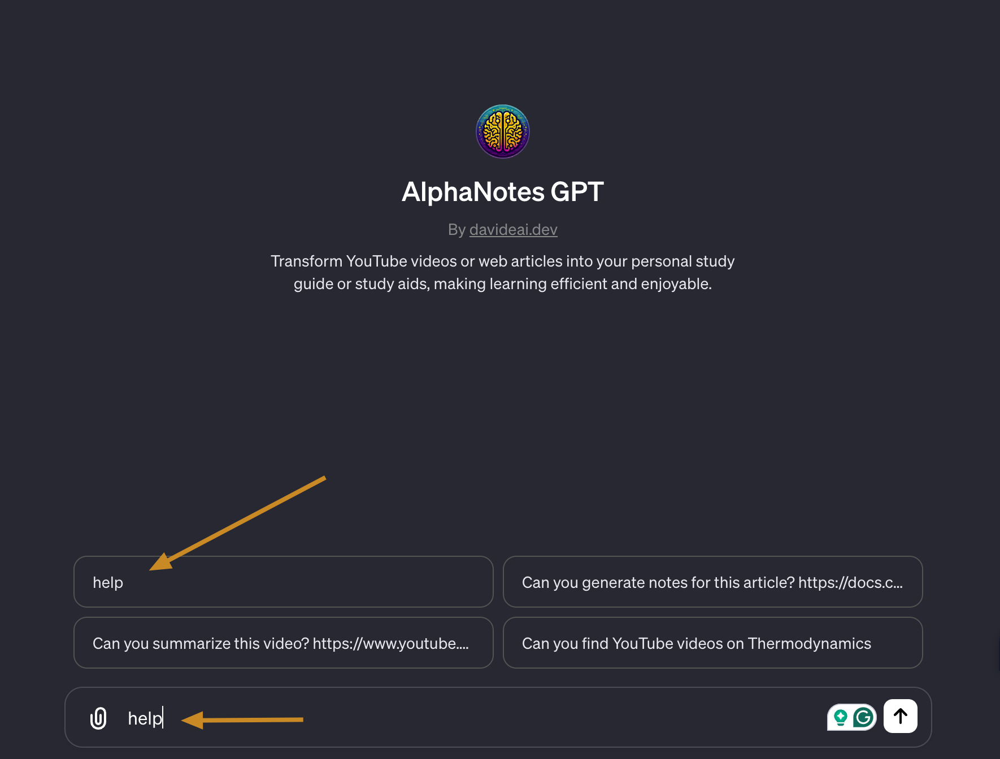
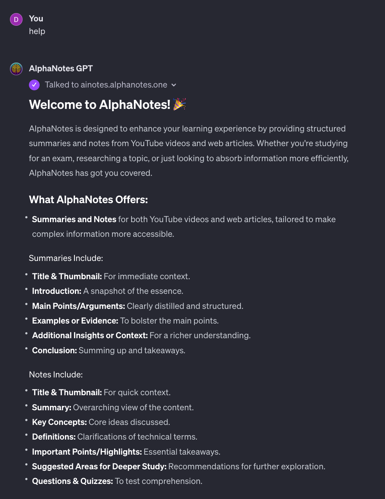

---
meta:
  title: "AlphaNotes help command tutorial"
description: Learn how to use the AlphaNotes help command with our tutorial. Access features, plans, and tutorials for enhanced learning. Start now!
label: Help desk
icon: info
order: 50
---

# How to print help information with AlphaNotes


Welcome to this step-by-step tutorial to help you quickly navigate the AlphaNotes GPT. Whether you're new to AlphaNotes or looking to refresh your memory on its capabilities, this guide will walk you through accessing and utilizing the help information feature effectively. This feature is crucial for understanding the range of features, limitations, available plans, and where to find further tutorials.

## Getting started

Start your interaction with AlphaNotes by either choosing it from the GPT Store or activating it in any chat session with the `@alphanotes` command.

[!button corners="pill" text="Try AlphaNotes on ChatGPT" size="l" target="blank"](https://chat.openai.com/g/g-ZdfrSRAyo-alphanotes-gpt)

### Request help information

Gaining access to the help information is straightforward:

- **Action:** Simply type _help_ in the ChatGPT prompt area and send the request.

```
help
```



### Review and continue

After issuing the help command, a detailed guide covering all aspects of the AlphaNotes plugin will be presented to you. This includes:

- **Features Overview:** Get acquainted with what AlphaNotes offers and how it can enhance your learning or content creation process.
- **Limitations and Plans:** Understand any restrictions and explore the various plans to find one that suits your needs best.
- **Tutorials:** Discover where to find more in-depth tutorials to make the most out of AlphaNotes.

Take your time to review the provided information. Knowledge of these details will empower you to utilize AlphaNotes to its full potential, tailoring its vast capabilities to your specific requirements.

Here is an example of how the response might look like; note that this is only part of the response:



---

This tutorial is just the beginning. With AlphaNotes, you're equipped to transform your learning and content engagement experiences. Should you have further questions or require additional assistance, don't hesitate to explore our [tutorials](https://www.alphanotes.one/tutorials) or reach out for support. Let's embark on this journey of discovery and efficiency together! 🚀

[!button corners="pill" text="Check out the other tutorials" size="2xl" target="blank"](https://www.alphanotes.one/tutorials)
