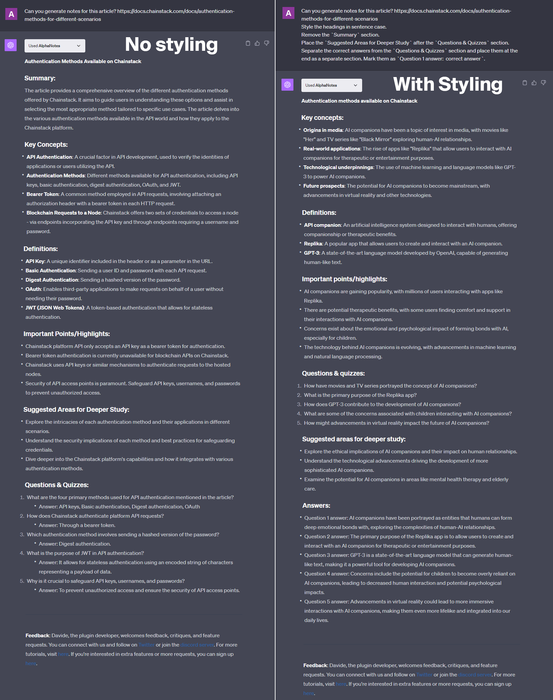

---
meta:
  title: "Master article notes styling with AlphaNotes"
description: Learn the art of formatting notes on articles using AlphaNotes on ChatGPT. Follow our step-by-step guide to enhance your note-taking skills.
label: How to style article notes
icon: paintbrush
order: 49
---

# How to style article notes with AlphaNotes


Discover the simplicity and effectiveness of styling and formatting article notes with AlphaNotes on ChatGPT. This tutorial provides a comprehensive walkthrough for transforming your article notes into organized, visually appealing summaries.

## Why focus on note styling?

Effective note-taking is more than just jotting down information; it's about organizing content to enhance comprehension and recall. AlphaNotes allows you to tailor your article notes to fit your personal or professional needs, making information retrieval quick and efficient. Imagine turning a dense article into a neatly formatted document where key points stand out and the structure aids understanding.

## Key elements of well-styled notes

A well-structured note with AlphaNotes emphasizes:

- **📌 Readability:** Using sentence case for headings to improve the flow and Readability.
- **📌 Organization:** Strategically placing sections for logical progression.
- **📌 Clarity:** Separating answers from questions to avoid confusion and enhance review efficiency.
- **📌 Customization:** Tailoring the format to suit your specific study or reference needs.

By focusing on these elements, AlphaNotes can transform your note-taking process, making your notes not only more visually appealing but also more functional.

## Your guide to styling notes with AlphaNotes

Enhance your note-taking with AlphaNotes by following these steps to apply advanced styling and formatting to your article notes.

[!button corners="pill" text="Try AlphaNotes on ChatGPT" size="l" target="blank"](https://chat.openai.com/g/g-ZdfrSRAyo-alphanotes-gpt)

### Requesting styled notes

To begin styling your article notes, here's what you need to do:

- **Initiate:** Start a conversation with AlphaNotes by selecting it from the GPT Store or using the `@alphanotes` command within any chat.
- **Request:** Provide the link to the article you want notes for and specify your styling preferences. For example:

```
Can you generate notes for this article? https://docs.chainstack.com/docs/authentication-methods-for-different-scenarios Style the headings in sentence case. Remove the Summary section. Place the Suggested Areas for Deeper Study after the Questions & Quizzes section. Separate the correct answers from the Questions & Quizzes section and place them at the end as a separate section. Mark them as Question 1 answer: correct answer.
```

This step instructs AlphaNotes to generate notes from your article and apply the specific formatting rules you've requested, creating a customized summary that meets your needs.

Here is an example of styled versus non-styled notes:



### Review and refine

After receiving your styled notes, you're encouraged to review and further customize them:

- **Export as PDF:** For comprehensive review or sharing purposes, convert your styled notes into PDFs, available starting from the Vidploma🎥 plan. This makes your notes portable and easily accessible offline.
- **Interactive Customization:** Don't hesitate to adjust the styling further. Suppose you need to tweak the format or request additional changes. In that case, AlphaNotes is designed to cater to your evolving preferences, ensuring your notes perfectly align with your study or reference needs.

## Conclusion

Through this tutorial, AlphaNotes invites you to explore the full potential of personalized note-taking. You can elevate your learning and information management strategies by mastering the art of styling and formatting article notes. Visit our [tutorials page](../tutorials.md) for more insights and to enhance your AlphaNotes experience. Happy noting!
