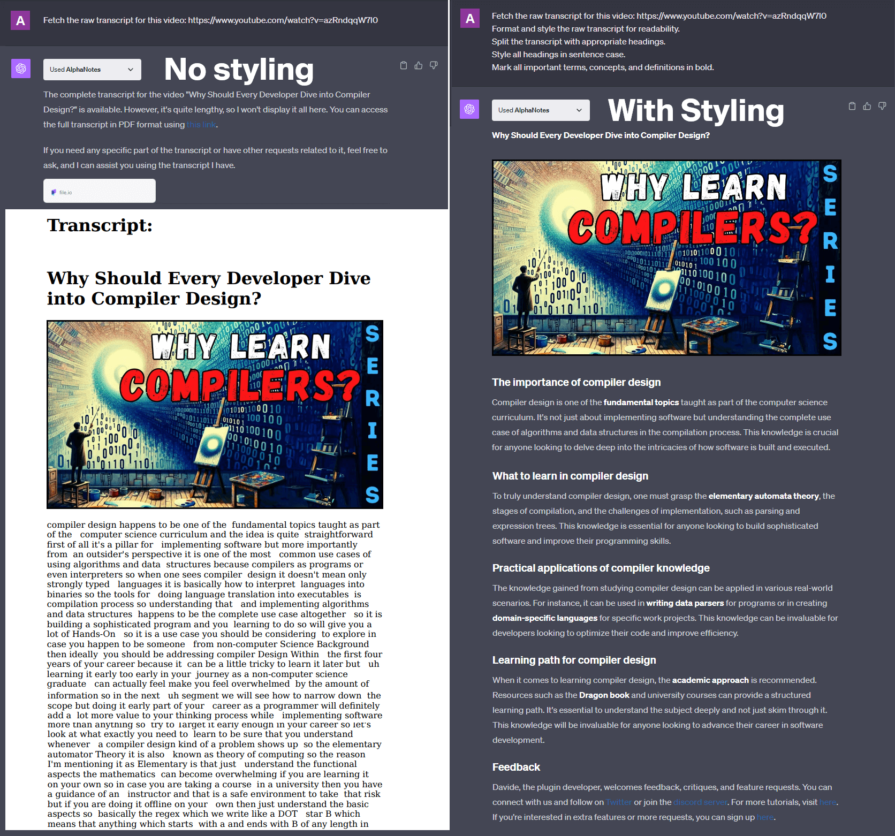

---
meta:
  title: "Master raw transcript styling with AlphaNotes"
description: Transform raw video transcripts into polished, readable documents with AlphaNotes on ChatGPT. Follow our guide for practical styling and formatting techniques.
label: How to style a raw transcript
icon: list-unordered
order: 46
---

# How to style a raw transcript with AlphaNotes


Unlock the potential of text-based content by learning how to style a raw video transcript with AlphaNotes on ChatGPT. This tutorial turns unformatted text into a well-organized, easily navigable document.

## The importance of transcript styling

A raw transcript offers a textual representation of video content, which is invaluable for deeper analysis, accessibility, and reference. However, with proper formatting, it can be manageable to sift through. Styling enhances readability, aids comprehension, and highlights critical information, making the content more engaging and valuable.

## Transforming transcripts with AlphaNotes

With AlphaNotes, you can elevate the utility and appearance of video transcripts by applying thoughtful styling and formatting. Here's how to harness AlphaNotes for your transcript styling needs:

[!button corners="pill" text="Try AlphaNotes on ChatGPT" size="l" target="blank"](https://chat.openai.com/g/g-ZdfrSRAyo-alphanotes-gpt)

### Requesting a styled transcript

Begin the transformation of your raw transcript by following these steps:

- **Initiate:** Open a dialogue with AlphaNotes by selecting it from the GPT Store or entering the `@alphanotes` command in any chat session.
- **Request:** Provide the video link for which you need a transcript and detail your formatting preferences. For example:

```
Fetch the raw transcript for this video: https://www.youtube.com/watch?v=azRndqqW7l0 Format and style the raw transcript for readability. Split the transcript with appropriate headings. Style all headings in sentence case. Mark all important terms, concepts, and definitions in bold.
```

This directive cues AlphaNotes to retrieve the transcript and apply your specified styling rules, resulting in a document that's readable and visually organized.

Here is an example of the results:



### Review and customize your transcript

After receiving the styled transcript, you're invited to personalize it further:

- **Export as PDF:** For those requiring a tangible or shareable version, AlphaNotes allows you to convert the styled transcript into a PDF document, enhancing its portability and accessibility.
- **Interactive Customization:** Should you wish to refine the formatting or make additional changes, AlphaNotes facilitates ongoing customization to meet your specific needs or preferences.

## Conclusion

This tutorial empowers you to transform raw video transcripts into structured, styled, and reader-friendly documents. By following these steps with AlphaNotes, you can significantly enhance the value and usability of transcripts for study, work, or personal projects. Visit our [tutorials page](https://www.alphanotes.one/tutorials/tutorial) for more insights and to optimize your experience with AlphaNotes. Embrace the power of practical transcript styling and make your content stand out. Happy styling!
