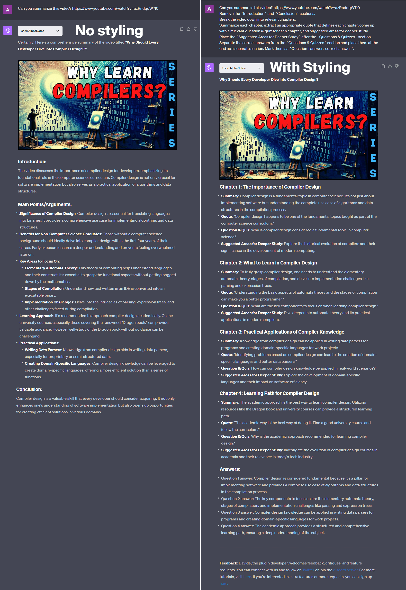

---
meta:
  title: "Master video summary styling with AlphaNotes"
description: Elevate your video summaries with AlphaNotes on ChatGPT. Follow our guide for practical styling and formatting techniques.
label: How to style a video summary
icon: project
order: 48
---

# How to style a video summary with AlphaNotes


Dive into the world of video summary styling with AlphaNotes on ChatGPT. This tutorial is your gateway to transforming video summaries into well-structured, engaging content pieces.

## Why focus on video summary styling?

Styling your video summaries goes beyond mere aesthetics; it enhances the viewer's understanding and engagement. With AlphaNotes, you can structure video summaries to highlight critical points, facilitate quicker learning, and provide a memorable viewing experience. Envision converting a lengthy video into a segmented, easy-to-digest summary that captivates and educates.

## Your guide to styling video summaries with AlphaNotes

Embrace the full potential of AlphaNotes to style your video summaries by following these intuitive steps.

[!button corners="pill" text="Try AlphaNotes on ChatGPT" size="l" target="blank"](https://chat.openai.com/g/g-ZdfrSRAyo-alphanotes-gpt)

### Requesting styled video summaries

Crafting your styled video summary starts here:

- **Initiate:** Engage with AlphaNotes by selecting it from the GPT Store or typing the `@alphanotes` command in any chat.
- **Request:** Submit the video link you wish to summarize and your styling instructions. For instance:

```
Can you summarize this video? https://www.youtube.com/watch?v=azRndqqW7l0 Remove the Introduction and Conclusion sections. Break the video down into relevant chapters. Summarize each chapter, extract an appropriate quote that defines each chapter, develop a relevant question & quiz for each chapter, and suggest areas for deeper study. Place the Suggested Areas for Deeper Study after the Questions & Quizzes section. Separate the correct answers from the Questions & Quizzes section and place them at the end as a separate section. Mark them as Question 1 answer: correct answer.
```

This process ensures your video summary is concise and tailored to your educational or informational goals.

Here is an example of styled versus non-styled video summaries:



### Review and refine

Once your restyled summary is in hand, seize the opportunity to customize it further:

- **Export as PDF:** Transform your summary into a PDF, starting with the Vidploma🎥 plan, for easy sharing or offline review.
- **Interactive Customization:** Feel free to refine the styling, request additional changes, or explore deeper topics mentioned. AlphaNotes supports your quest for the perfect summary, catering to your evolving needs and preferences.

## Conclusion

By following this tutorial, AlphaNotes encourages you to explore new dimensions in video summarization. Mastering the styling and formatting of video summaries can revolutionize how you consume and share information. Check out our [tutorials page](https://www.alphanotes.one/tutorials/tutorial) for further insights and optimization tips. Elevate your video summarization game with AlphaNotes. Happy summarizing!
