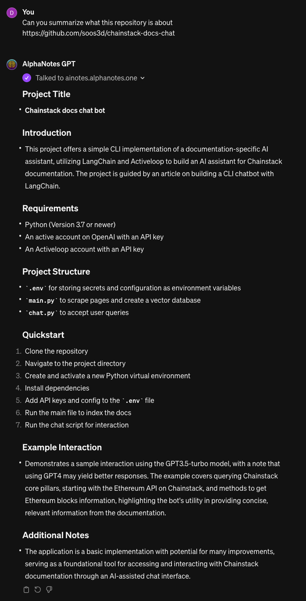

---
meta:
  title: "Effortlessly Summarize GitHub Repositories with AlphaNotes"
description: Master the art of summarizing GitHub repositories using AlphaNotes. This guide walks you through generating concise summaries to understand projects quickly.
label: How to get a GitHub repository summary
icon: code-review
order: 45
---

# Effortlessly summarize GitHub repositories with AlphaNotes


Unlock the potential of GitHub with AlphaNotes on ChatGPT by learning how to generate summaries of GitHub repositories. This tutorial guides you through the process, making it simple to grasp the essence of any project.

## Why GitHub repository summaries?

With millions of repositories available, navigating GitHub to find projects that align with your interests or needs can be daunting. AlphaNotes streamlines this process by summarizing repositories and providing a quick overview of their purpose, how they work, and how you can get started using them.

## Anatomy of a GitHub repository summary

An effective GitHub Repository Summary through AlphaNotes includes:

- **📌 Repository Name & Owner:** Quick identification of the project and its maintainer.
- **📌 Description:** A brief overview capturing the repository's purpose.
- **📌 Key Features:** Highlights of the project's functionality and unique offerings.
- **📌 Installation & Usage Instructions:** Easy-to-follow steps to get the project running on your machine.

These components ensure you receive a comprehensive repository snapshot, enhancing your understanding and decision-making process.

## Your guide to generating GitHub repository summaries with AlphaNotes

Discovering the core insights of GitHub repositories has always been challenging. Follow these steps to leverage the new feature:

[!button corners="pill" text="Try AlphaNotes on ChatGPT" size="l" target="blank"](https://chat.openai.com/g/g-ZdfrSRAyo-alphanotes-gpt)

### Requesting a summary

To access the wealth of information within GitHub repositories, simply:

- **Start:** Initiate a session with AlphaNotes by selecting it from the GPT Store or activating it in any chat via the `@alphanotes` command.
- **Action:** Ask for a repository summary by providing the GitHub URL you're interested in. Use the format:

```sh
Can you summarize what this repository is about https://github.com/soos3d/chainstack-docs-chat
```

AlphaNotes will analyze the repository's README and relevant documentation to craft a structured summary, encapsulating all vital aspects.

### Engage and explore

With your GitHub repository summary at hand, you're ready to delve deeper:

- **Bookmark for Later:** Keep track of exciting repositories by bookmarking summaries.
- **Collaborative Learning:** Share the summary with peers or team members to discuss potential uses or contributions to the project.
- **Further Exploration:** Utilize the summary as a base for further research, exploring related projects, technologies, or the repository's issues, and pull requests for more insights.

Here is an example of what your GitHub repository summary might look like:



Begin your journey through GitHub's vast ecosystem with AlphaNotes. Utilize the GitHub Repository Summaries feature to streamline your exploration and comprehension of projects. Dive into new technologies, contribute to open-source projects, or find inspiration for your next big idea. 🚀

Visit our [tutorials page](https://www.alphanotes.one/tutorials/tutorial) for more information and tips on getting the most out of your AlphaNotes experience. Happy coding!
