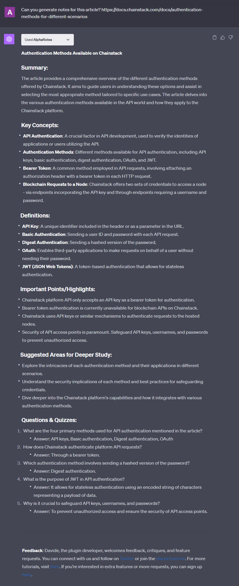

---
meta:
  title: "Efficient Note-Taking with AlphaNotes"
description: Discover how to use AlphaNotes for effective note-taking on articles. This tutorial guides you through generating detailed notes to enhance your study sessions.
label: How to get an article study aid
icon: bookmark
order: 46
---

# How to take notes from articles


Step into the realm of productive study sessions with AlphaNotes on ChatGPT by learning how to take notes on articles efficiently. This guide provides a straightforward method for transforming complex articles into organized, accessible study aids.

## Why article notes?

In an era overflowing with information, efficiently taking notes on articles is invaluable. AlphaNotes offers a streamlined solution to this challenge by enabling you to generate structured notes from any online article. Envision turning a dense, informative article into clear, concise notes highlighting critical information, making study sessions more effective and less time-consuming.

## Anatomy of effective notes

High-quality notes created with AlphaNotes include:

- **Summary**: An overarching view of the study material, providing a quick snapshot of what to expect and the key themes to be discussed.
- **Key Concepts**: Bullet-pointed essentials that form the foundation of the topic at hand, allowing for a swift grasp of the subject matter.
- **Definitions**: A dedicated section that demystifies technical terms or specialized jargon, ensuring terms are clearly understood.
- **Important Points/Highlights**: The crux of the material is distilled here, underscoring the primary messages and takeaways.
- **Suggested Areas for Deeper Study**: This segment guides learners towards additional content and resources for a more in-depth topic exploration.
- **Questions & Quizzes**: Interactive elements designed to test understanding and reinforce learning, ensuring engagement with the content.

These elements combine to create a comprehensive yet succinct study aid that enhances your learning process.

## Your guide to generating article notes with AlphaNotes

Creating compelling study aids from articles is effortless with AlphaNotes. Follow these steps to enrich your studying:

[!button corners="pill" text="Try AlphaNotes on ChatGPT" size="l" target="blank"](https://chat.openai.com/g/g-ZdfrSRAyo-alphanotes-gpt)

### Requesting notes

To transform articles into valuable study aids, begin here:

- **Start:** Initiate a session with AlphaNotes by choosing it in the GPT Store or employing the `@alphanotes` command in any chat.
- **Action:** Share the article link for which you need notes. Format your request as follows:

```
Can you generate notes for this article? https://docs.chainstack.com/docs/authentication-methods-for-different-scenarios
```

AlphaNotes will analyze the article, extracting essential information and organizing it into an easily reviewable format.

### Review and customize

After receiving your notes, it's time to make them your own:

- **Customization:** Adjust the generated notes to suit your study preferences or focus areas better.
- **Export Options:** With the Vidploma🎥 plan, export your customized notes to PDF for offline study or sharing purposes.
- **Interactive Learning:** Utilize the notes as a foundation for deeper exploration. Engage with the material by asking follow-up questions or adding personal annotations to enhance comprehension and retention.

Here's a glimpse of what your notes might look like:



Embark on a journey of streamlined studying with AlphaNotes. Leverage the power of effective note-taking to make your educational pursuits more efficient and insightful. Investigate, annotate, and delve deeper into your studies with AlphaNotes as your ally. 🚀

For more tips and strategies on making the most of your AlphaNotes experience, check out our [tutorials page](https://www.alphanotes.one/tutorials/tutorial). Happy studying!
