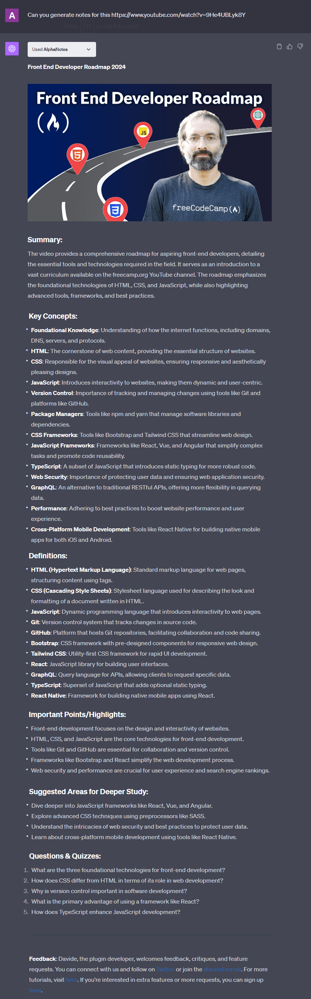

---
meta:
  title: "Make a YouTube study aid with AlphaNotes"
description: Transform YouTube videos into study aids with AlphaNotes. Automated summaries, customizable notes, and easy PDF exports enhance your learning.
label: Make a YouTube study aid
icon: note
order: 48
---

# Make a YouTube study aid with AlphaNotes


Embark on a journey to revolutionize your study habits with the AlphaNotes ChatGPT plugin. This tutorial is designed to walk you through the seamless process of taking efficient notes on YouTube videos, turning them into a powerful resource for learning and research.

## The importance of effective note-taking

Effective note-taking is crucial in today's digital age, where learning and information consumption often happen through video content. AlphaNotes enhances your ability to take detailed, organized notes from YouTube videos directly, facilitating a more engaged and productive learning experience. Imagine converting a dense, one-hour documentary into a structured, easy-to-review notes document, streamlining your study process and saving precious time.

## Key features of AlphaNotes notes

AlphaNotes elevates your note-taking with features that include:

- **📌 Automated Summarization:** Instantly generate concise notes that capture the essential points of the video.
- **📌 Customization Options:** Tailor your notes to match your study needs, emphasizing areas of interest or importance.
- **📌 Exportability:** Convert your notes into a PDF for offline study or sharing with classmates.

With these tools at your disposal, AlphaNotes simplifies your study sessions and makes them more effective.

> 💡 Note that features like PDF exports are only available starting from the Vidploma Plan 🎥.

## Your guide to using AlphaNotes for YouTube notes

Turning YouTube videos into valuable study aids is easy with AlphaNotes. The following section will show you how to leverage this feature for your educational advantage.

[!button corners="pill" text="Try AlphaNotes on ChatGPT" size="l" target="blank"](https://chat.openai.com/g/g-ZdfrSRAyo-alphanotes-gpt)

### Requesting notes for a YouTube video: A Closer Look

In the digital era, where video content reigns supreme, having a tool that can distill complex information into manageable notes is invaluable. AlphaNotes serves this purpose as a bridge between expansive video content and concise, actionable notes. Whether for academic study, professional development, or personal interest, AlphaNotes ensures you can capture the essence of any YouTube video without getting lost in the details.

Here's how to begin transforming video content into your personalized study aid:

- **Start Your Journey:** The first step involves integrating AlphaNotes into your study toolkit. Access AlphaNotes directly by selecting it from the GPT Store, or streamline your workflow within any chat environment by activating it with the `@alphanotes` command. This initial step is your gateway to a world of efficient learning.

- **Action - Requesting Notes:** With AlphaNotes at your fingertips, it's time to unlock its potential. Provide the link to the YouTube video you wish to explore further by typing your request in a simple yet powerful format:

```
Can you generate notes for this video? https://www.youtube.com/watch?v=9He4UBLyk8Y
```

Upon receiving your request, AlphaNotes analyzes the video's content with advanced comprehension capabilities. It then extracts the critical information, presenting detailed notes highlighting the main points, themes, and essential insights. This streamlined process saves time and enhances your ability to engage with and remember the material.

By following these steps, you are not just watching a video; you are actively constructing a knowledge base tailored to your learning needs and preferences.

### What's included in the notes

Our study aids are organized to foster a practical learning experience, regardless of the subject matter. Here's what each aid typically includes:

- **Summary**: An overarching view of the study material, providing a quick snapshot of what to expect and the key themes to be discussed.
- **Key Concepts**: Bullet-pointed essentials that form the foundation of the topic at hand, allowing for a swift grasp of the subject matter.
- **Definitions**: A dedicated section that demystifies technical terms or specialized jargon, ensuring terms are clearly understood.
- **Important Points/Highlights**: The crux of the material is distilled here, underscoring the primary messages and takeaways.
- **Suggested Areas for Deeper Study**: This segment guides learners towards additional content and resources for a more in-depth topic exploration.
- **Questions & Quizzes**: Interactive elements designed to test understanding and reinforce learning, ensuring engagement with the content.

Each aid component is crafted to build upon the last, culminating in a comprehensive tool that supports both breadth and depth of understanding in any study area.

Here is an example of how notes will look like.



### Review and customize

After receiving your notes, take a moment to review them. AlphaNotes allows you to customize these notes to suit your learning objectives better. Whether adding personal insights, emphasizing certain sections, or preparing them for group study, the flexibility is yours.

### Export and share

For those who prefer physical copies or need to share study materials, AlphaNotes offers an option to export your notes as a PDF. This feature is invaluable for creating tangible study aids or distributing materials among peers.

> 💡 Available starting on the Vidploma Plan 🎥.

## Conclusion

Following this guide, you can transform any YouTube video into a structured, useful study aid with AlphaNotes. Dive deeply into your subjects, maintain organized notes, and elevate your learning experience to new heights. 🚀

Explore maximizing your study efficiency with AlphaNotes by visiting our [tutorials page](https://www.alphanotes.one/tutorials/tutorial). Embrace the power of effective note-taking and make your educational journey a breeze!
