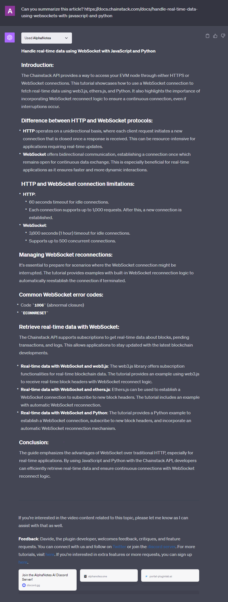

---
meta:
  title: "Master Article Summarization with AlphaNotes"
description: Learn to create summaries of articles with AlphaNotes. This tutorial shows you how to turn extensive articles into concise summaries for enhanced learning.
label: How to get an article summary
icon: book
order: 47
---

# Master Article Summarization with AlphaNotes


Dive into the world of efficient learning with AlphaNotes on ChatGPT by mastering the technique of article summarization. This guide will quickly walk you through converting detailed articles into concise, informative summaries.

## Why article summaries?

In the digital era, where content is abundant, the ability to quickly distill essential information from articles is crucial. AlphaNotes enables you to extract and condense the main ideas from online articles into easy-to-digest summaries. Imagine turning a comprehensive article into a summary that captures all the key points, saving time and enhancing your comprehension.

## Anatomy of an Effective Summary

A top-notch summary from AlphaNotes features:

- **📌 Title & Thumbnail:** Quick context recognition.
- **📌 Introduction:** A concise overview that captures the article's essence.
- **📌 Key Points:** The most important information is presented in a clear, structured format.
- **📌 Examples:** Carefully selected to bolster the understanding of key points.
- **📌 Conclusion:** A succinct wrap-up emphasizing the main takeaways.

Utilizing these elements, AlphaNotes boosts your learning efficiency, making it thorough and time-saving.

## Your guide to generating article summaries with AlphaNotes

Leveraging AlphaNotes to generate article summaries is a seamless process that enriches your content consumption. Here's how to harness this feature effectively:

[!button corners="pill" text="Try AlphaNotes on ChatGPT" size="l" target="blank"](https://chat.openai.com/g/g-ZdfrSRAyo-alphanotes-gpt)

### Requesting a Summary

To begin unlocking the insights within articles, follow these steps:

- **Start:** Open a chat with AlphaNotes by selecting it from the GPT Store or activating it within any chat using the `@alphanotes` command.
- **Action:** Request a summary by sharing the article link you're interested in. Use the format:

```
Can you summarize this article? https://docs.chainstack.com/docs/handle-real-time-data-using-websockets-with-javascript-and-python
```

AlphaNotes will then process the article, pulling out crucial information and organizing it into a structured summary.

### Engage and explore

After receiving your article summary, you're set to deepen your understanding:

- **Export as PDF:** Available starting from the Vidploma🎥 plan, this option allows you to convert your summaries into PDFs for offline review or sharing.
- **Interactive Learning:** Use the summary as a launching pad for further inquiry. Pose follow-up questions, delve into related topics, or explore specific details mentioned in the summary. This active engagement helps solidify your grasp of the article's core themes and expands your knowledge base.

Here is an example of what your summary might look like:



Embark on a journey of streamlined learning with AlphaNotes. Embrace the power of article summarization to make your educational endeavors more productive and insightful. Explore, question, and delve deeper into topics with AlphaNotes by your side. 🚀

For further information and tips on maximizing your AlphaNotes experience, visit our [tutorials page](https://www.alphanotes.one/tutorials/tutorial). Enjoy your learning journey!
