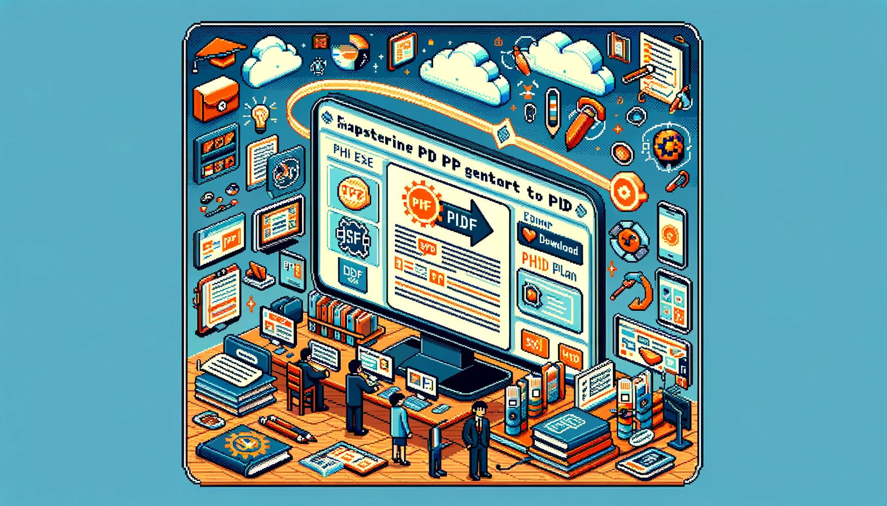
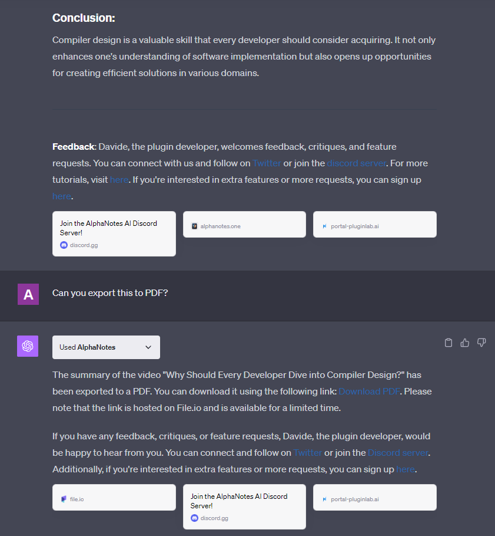

---
meta:
title: "Master PDF export with AlphaNotes"
description: This is a step-by-step guide for Ph.D. Plan users on how to export ChatGPT-generated content into a PDF with AlphaNotes. Perfect for archiving, sharing, or printing.
label: How to get a PDF export
icon: checklist
order: 47
---

# How to get a PDF export with AlphaNotes



Unlock the capability to archive, share, and print your ChatGPT-generated content by learning how to export it to PDF with AlphaNotes. This tutorial is designed for PhD Plan subscribers seeking to extend the utility of their generated content.

## The benefits of exporting to PDF

PDF exports provide a versatile format for managing the valuable insights and materials created by ChatGPT. Whether it's for keeping a personal archive, sharing insights with peers, or preparing print materials, the PDF export feature is an essential tool for users looking to maximize the value of their content.

## Navigate the PDF export process

Turn your ChatGPT-generated content into portable PDF documents by following these steps:

[!button corners="pill" text="Try AlphaNotes on ChatGPT" size="l" target="blank"](https://chat.openai.com/g/g-ZdfrSRAyo-alphanotes-gpt)

### Verifying your plan

- **Ensure PhD Plan Access:** Confirm your subscription to the PhD Plan to unlock the PDF export feature.

### Creating content

- **Content Generation:** Use ChatGPT to create the content you wish to export, whether it's summaries, study aids, or custom text.

### Initiating export

- **Export Request:** Directly ask ChatGPT to convert your generated content into a PDF:

```
Can you export this to PDF?
```

### Receiving your PDF

- **Download Your PDF:** ChatGPT will provide a link to download your PDF document after a brief loading period. This step may take 20 to 30 seconds, so patience is vital.

Here is how it will look:



## Conclusion

This tutorial demystifies converting ChatGPT-generated content into PDFs for PhD Plan users. By following these steps, you can enhance your content's accessibility and utility, making saving, sharing, and utilizing your generated materials easier. For more guidance and to explore additional features, visit our [tutorials page](https://www.alphanotes.one/tutorials). Embrace the full potential of your PhD Plan with AlphaNotes and take your content management to the next level. Happy exporting!
