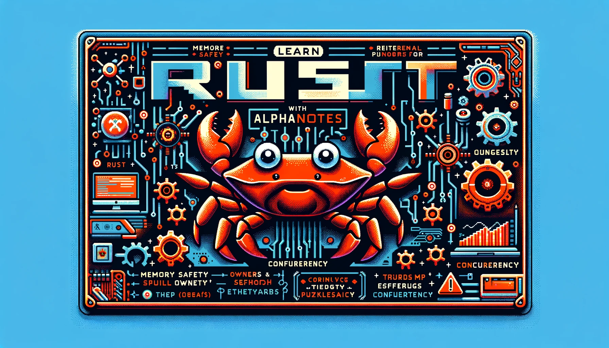
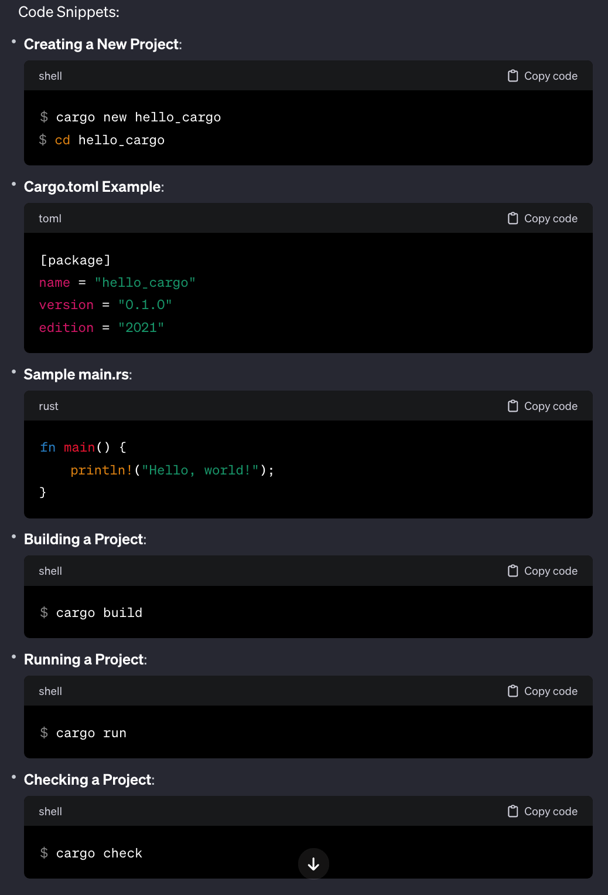

---
meta:
  title: "Learn Rust with AlphaNotes"
description: Unlock the power of learning Rust, the fast and memory-efficient programming language, with AlphaNotes on ChatGPT. Follow our guide to generate and customize notes from the Rust Book efficiently.
label: Learn Rust with AlphaNotes
icon: code
order: 46
---

# Learn Rust with AlphaNotes



Dive into Rust, a system programming language known for its speed, memory safety, and parallelism. Rust is designed to help developers build reliable and efficient software, from operating systems to game engines. Whether you're a novice eager to explore Rust's syntax or an experienced developer aiming to refine your skills, AlphaNotes can streamline your learning process by generating concise notes and summaries from the Rust Book.

## Your guide to mastering Rust with AlphaNotes

Enhance your Rust learning experience by leveraging AlphaNotes to create tailored study materials.

[!button corners="pill" text="Try AlphaNotes on ChatGPT" size="l" target="blank"](https://chat.openai.com/g/g-ZdfrSRAyo-alphanotes-gpt)

### Starting your journey

- **Discover AlphaNotes:** Locate and sign up for AlphaNotes in the GPT store, ranked within the top 10 education apps for easy access.

### Generating notes from the Rust Book

- **Request Notes:** Direct ChatGPT to generate notes for specific sections of the Rust Book by providing URLs:

```
Can you make notes for this? https://rust-book.cs.brown.edu/ch01-03-hello-cargo.html
```

### Tailoring your study materials

- **Customize for Depth:** After reviewing the initial notes, enhance them by including code snippets or other specific details you need:

```
Can you add the code snippets to the notes?
```

ChatGPT will refine the notes to include the requested details, enriching your study materials.



## Conclusion

AlphaNotes offers a dynamic approach to learning Rust, allowing you to transform sections of the Rust Book into digestible, customized notes. This method saves time and ensures that you focus on the essentials, with the ability to dive deeper where needed. With AlphaNotes and ChatGPT, you can navigate Rust's learning curve more efficiently, paving the way toward mastering this powerful programming language. For more insights and to enhance your programming skills, visit our [tutorials page](https://www.alphanotes.one/tutorials). Embark on your journey to becoming proficient in Rust with AlphaNotes at your side. Happy coding!
