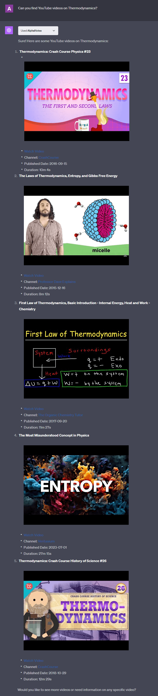
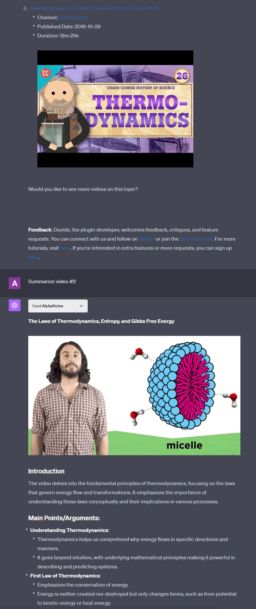
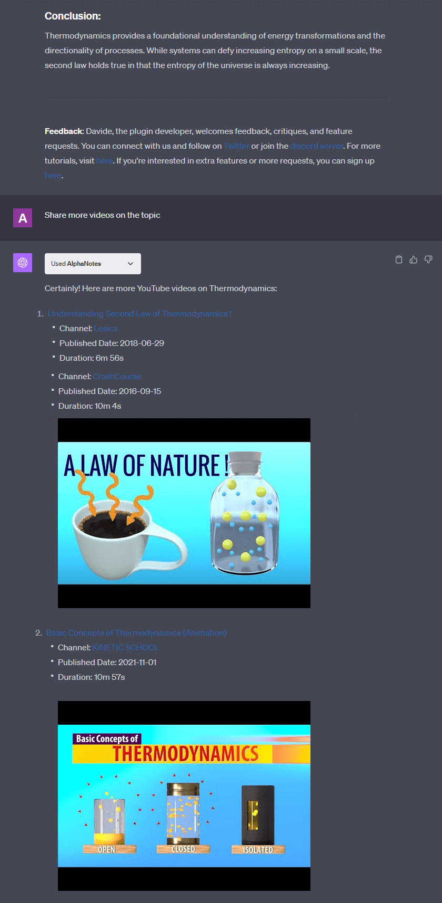

---
meta:
  title: "Master in-chat video search with AlphaNotes"
description: Discover how to seamlessly search for and browse YouTube videos directly within the ChatGPT interface using AlphaNotes. Follow our easy step-by-step guide.
label: How to search videos in-chat
icon: search
order: 48
---

# How to search videos in-chat with AlphaNotes


Explore the convenience of searching for and browsing YouTube videos directly from the ChatGPT interface with AlphaNotes. This tutorial simplifies your video search process, integrating it into your ChatGPT workflow for efficiency and ease.

## Why search videos in chat?

Searching for YouTube videos within ChatGPT streamlines your workflow, eliminating the need to switch between tabs or devices. This feature saves time and keeps your focus intact, enhancing productivity.

## Navigate video search with AlphaNotes

Discover the simplicity of in-chat video searches with AlphaNotes by following these straightforward steps:

[!button corners="pill" text="Try AlphaNotes on ChatGPT" size="l" target="blank"](https://chat.openai.com/g/g-ZdfrSRAyo-alphanotes-gpt)

### Getting started with video searches

Begin your in-chat video search journey here:

- **Get AlphaNotes:** Ensure AlphaNotes is installed from the ChatGPT store to unlock the full potential of in-chat functionalities.
- **Start Searching:** Directly ask ChatGPT to search for YouTube videos by providing your query, like:

```
Can you find YouTube videos on Thermodynamics?
```

Here is how it will look like:



### Dive into video summaries

After receiving a list of video options:

- **Select for Summary:** Choose a video from the list by indicating its number or title and ask for a summary:

```
Summarize video #2
```

Like this:



### Expand your search

Continue exploring your topic:

- **More Videos:** Request further searches on the topic without limiting your exploration:

```
Share more videos on the topic.
```

Here is an example:



### Seamless workflow

Repeat the process as desired:

- **Rinse and Repeat:** Engage in a continuous cycle of search and summary for a comprehensive understanding and discovery of content.

## Conclusion

Leveraging AlphaNotes for in-chat video searches transforms how you interact with video content on YouTube, making it a seamless extension of your ChatGPT experience. This tutorial guides you through each step, ensuring a streamlined process for finding, summarizing, and exploring videos without leaving the chat interface. Visit our [tutorials page](../tutorials.md) for more insights and to enhance your AlphaNotes journey further. Dive into the world of efficient in-chat video searches and make the most of your time and effort. Happy searching!
