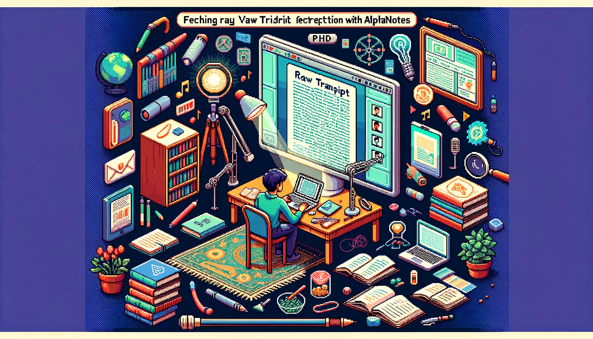

---
meta:
  title: "Master raw transcript retrieval with AlphaNotes"
description: Learn how to fetch and utilize raw video transcripts for comprehensive analysis and study with AlphaNotes on ChatGPT. Ideal for advanced learners and researchers.
label: How to get a raw transcript
icon: paste
order: 49
---

# How to get a raw transcript with AlphaNotes



Dive into the depth of video content by learning how to fetch raw transcripts directly through the ChatGPT interface with AlphaNotes. This tutorial is tailored for those seeking advanced learning and research using raw transcripts for detailed analysis, summarization, and note-taking.

## The value of raw transcripts

Raw transcripts are invaluable resources for learners and researchers, providing the foundational material for in-depth study and content manipulation. Raw transcripts are available exclusively to users on the PhD Plan, and they offer unfettered access to video content in textual form.

## Your guide to raw transcript retrieval

Unlock the potential of raw transcripts with AlphaNotes by following these straightforward steps:

[!button corners="pill" text="Try AlphaNotes on ChatGPT" size="l" target="blank"](https://chat.openai.com/g/g-ZdfrSRAyo-alphanotes-gpt)

### Securing access

- **PhD Plan Requirement:** Verify your subscription to the PhD Plan to ensure access to the raw transcript feature.

### Fetching a transcript

- **Initiate Transcript Retrieval:** Identify the video of interest and request its raw transcript by asking ChatGPT in an AlphaNotes chat:

```
Fetch the raw transcript for this video: https://www.youtube.com/watch?v=azRndqqW7l0
```

Here is an example:


### Review and utilize the transcript

- **Transcript and PDF Delivery:** Receive the raw transcript within the ChatGPT interface and as a PDF document, ready for comprehensive review and analysis.

### Engaging with the transcript

- **Direct Further Actions:** Guide ChatGPT to perform additional tasks on the transcript, such as summarizing, pinpointing key points, or creating study aids based on your needs.

## Conclusion

This tutorial facilitates a deep dive into video content analysis, offering a pathway to obtain and leverage raw transcripts for those on the PhD Plan. With AlphaNotes and ChatGPT, accessing and working with raw transcripts becomes a seamless part of your research and learning journey. For more insights and to maximize your AlphaNotes usage, visit our [tutorials page](https://www.alphanotes.one/tutorials/tutorial). Embrace the power of raw transcripts and enhance your educational endeavors. Happy researching!
