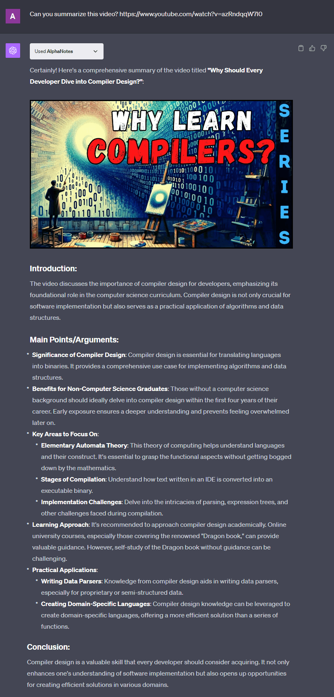

# How to get a video summary with AlphaNotes


Unlock the power of concise learning through the AlphaNotes ChatGPT plugin by mastering the art of generating insightful video summaries. This tutorial guides you in transforming lengthy video content into digestible, actionable insights with minimal effort.

## Why opt for video summaries?

In today's fast-paced world, the ability to quickly capture the essence of video content is more important than ever. With information at our fingertips, sifting through it efficiently can be challenging. AlphaNotes addresses this by enabling you to extract and condense the core messages from YouTube videos into easy-to-understand summaries. Picture this: a 30-minute lecture condensed into a few minutes of reading, saving you time while enhancing your learning process.

## Anatomy of a good summary

A well-crafted summary from AlphaNotes includes:

- **📌 Title & Thumbnail:** Immediate context recognition at a glance.
- **📌 Introduction:** A brief overview capturing the essence of the video.
- **📌 Main Points:** Key information distilled and structured for clarity.
- **📌 Examples:** Selected to effectively reinforce and illustrate the main points.
- **📌 Conclusion:** Concise wrap-up with key takeaways.

By leveraging these elements, AlphaNotes elevates your learning experience, making it efficient and comprehensive.

## Your guide to generating summaries with AlphaNotes

Harnessing the power of AlphaNotes to generate video summaries is a straightforward process designed to enhance your learning and content exploration. Here's how you can make the most of this feature:

### Requesting a Summary

Initiating a request for a video summary is your first step toward accessing condensed and insightful information. Whether you're using the AlphaNotes GPT directly or invoking it within ChatGPT, here's how to proceed:

- **Start:** Begin by initiating a chat with AlphaNotes by selecting it from the GPT Store or using the `@alphanotes` command to activate it within any chat.
- **Action:** Request a summary by providing the YouTube video link you're interested in. Type your request in the following format:

  ```
  Can you summarize this video? https://www.youtube.com/watch?v=azRndqqW7l0
  ```

  This action prompts AlphaNotes to analyze the video content, extracting key points, concepts, and insights to create a structured summary.

### Engage and explore

Once you receive the video summary, a realm of possibilities opens up for you to deepen your understanding and retain information:

- **Export as PDF:** For those on the PhD plan, AlphaNotes can convert your video summaries into PDFs. This feature is handy for creating study materials that can be reviewed offline or shared with peers. To utilize this feature, follow the prompt or command to convert your summary after it's generated.
- **Interactive Learning:** The summary serves as a springboard for further exploration. You are encouraged to engage with the content actively. Ask follow-up questions to clarify doubts, explore related topics, or dive deeper into specific points mentioned in the summary. This interactive learning approach ensures you grasp the video's core message and fully explore its subject matter.

Here is an example of how a summary will look like:



This tutorial sets the stage for a transformative approach to learning with AlphaNotes. Make the most of your educational content by harnessing the efficiency and clarity of video summaries. Dive deeper, ask questions, and explore subjects in greater detail with AlphaNotes at your side. 🚀

For more insights and tips on maximizing your use of AlphaNotes, check out our [tutorials page](https://www.alphanotes.one/tutorials). Happy learning!
